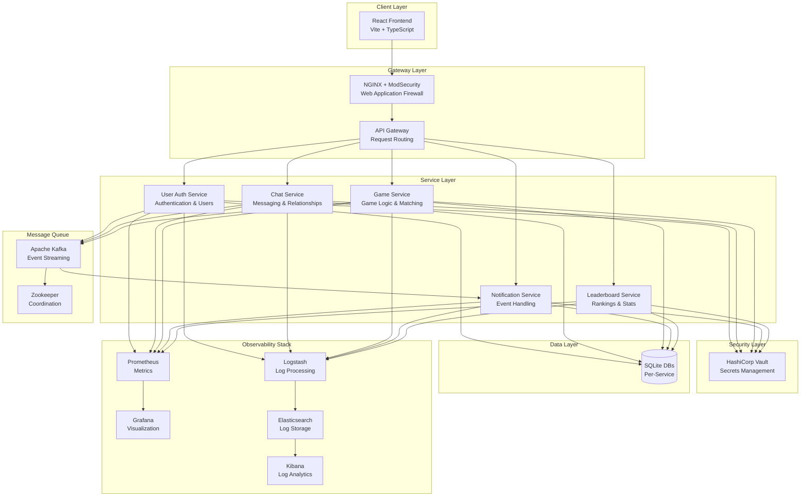

<div align="center">

# 🎮 ft_transcendence

### Enterprise-Grade Real-Time Gaming & Social Platform

[](https://www.typescriptlang.org/)
[](https://reactjs.org/)
[](https://nodejs.org/)
[](https://www.docker.com/)
[](https://kafka.apache.org/)

*A production-ready, microservices-based real-time platform featuring live chat, multiplayer gaming, and comprehensive observability stack*

[Features](#-features) • [Architecture](#-architecture) • [Tech Stack](#-technology-stack) • [Getting Started](#-getting-started) • [Documentation](#-documentation)

</div>

---

## 📋 Table of Contents

- [Overview](#-overview)
- [Key Features](#-key-features)
- [Architecture](#-architecture)
- [Technology Stack](#-technology-stack)
- [Security Features](#-security-features)
- [Infrastructure & DevOps](#-infrastructure--devops)
- [Getting Started](#-getting-started)
- [Project Structure](#-project-structure)
- [API Documentation](#-api-documentation)
- [Monitoring & Observability](#-monitoring--observability)
- [Contributing](#-contributing)

---

## 🌟 Overview

**ft_transcendence** is a modern, full-stack web application that demonstrates enterprise-level architecture and development practices. Built with a microservices architecture, it showcases real-time communication, event-driven design, comprehensive security measures, and production-grade infrastructure.

### 🎯 What Makes This Special?

- 🏗️ **Microservices Architecture** - Independently deployable services with clear boundaries
- ⚡ **Real-Time Everything** - WebSocket-powered instant messaging and live notifications
- 🔐 **Security-First Design** - WAF, Vault secrets management, JWT authentication
- 📊 **Full Observability** - Complete monitoring with Prometheus, Grafana, and ELK stack
- 🚀 **Event-Driven** - Apache Kafka for reliable, scalable async communication
- 🎮 **Multi-Game Support** - Extensible gaming framework with TicTacToe and Pong

---

## ✨ Key Features

### 💬 Real-Time Chat System
- **Instant Messaging** - WebSocket-based real-time chat with message history
- **User Relationships** - Friend management with block/unblock capabilities
- **Privacy Controls** - User-level notification preferences (mute/unmute)
- **Read Receipts** - Track message delivery and read status
- **Online Presence** - Live user status tracking across the platform
- **Search & Discovery** - Find and connect with users instantly

### 🎮 Multiplayer Gaming Platform
- **TicTacToe** - Real-time multiplayer with game state synchronization
- **Pong** - Classic game with live opponent matching
- **Challenge System** - Send and receive game invitations
- **Leaderboard** - Global rankings and player statistics
- **Game History** - Track wins, losses, and performance metrics

### 🔔 Smart Notification System
- **Multi-Channel Notifications** - Toast notifications, in-app alerts, and persistent storage
- **Event-Driven** - Kafka-powered notification delivery with guaranteed delivery
- **User Preferences** - Granular control over notification types and delivery
- **Offline Support** - Notifications queued for offline users
- **Type-Specific Handling** - Different notification styles for messages, challenges, and system events

### 👤 User Management
- **OAuth Integration** - Secure authentication with JWT tokens
- **Profile Customization** - Avatars, backgrounds, bios, and privacy settings
- **Session Management** - Refresh token rotation and automatic token renewal
- **Account Security** - Password hashing, rate limiting, and audit logs

---

## 🏗️ Architecture

### System Design



### Microservices Architecture

Each service is independently:
- **Deployable** - Container-based with Docker
- **Scalable** - Horizontal scaling capability
- **Testable** - Isolated business logic
- **Maintainable** - Clear service boundaries

#### Service Breakdown

| Service | Responsibility | Port | Database |
|---------|---------------|------|----------|
| **API Gateway** | Request routing, load balancing | 3000 | - |
| **User Auth** | Authentication, user management | 3001 | users.sqlite |
| **Chat Service** | Messaging, relationships | 3002 | chat.sqlite |
| **Game Service** | Game logic, matchmaking | 3003 | game.sqlite |
| **Notification** | Event handling, notifications | 3006 | notification.sqlite |
| **Leaderboard** | Rankings, statistics | 3004 | leaderboard.sqlite |

---

## 🛠️ Technology Stack

### Frontend
- **React 18** - Modern UI with hooks and context
- **TypeScript** - Type-safe development
- **Vite** - Lightning-fast build tool
- **Socket.io Client** - Real-time communication
- **Zustand** - Lightweight state management
- **Tailwind CSS** - Utility-first styling
- **Lucide Icons** - Beautiful icon library

### Backend
- **Node.js 20** - JavaScript runtime
- **Fastify** - High-performance web framework
- **TypeScript** - Type safety across services
- **Socket.io** - WebSocket server implementation
- **Better-SQLite3** - Synchronous SQLite database
- **JWT** - Stateless authentication

### Message Queue & Events
- **Apache Kafka** - Distributed event streaming
- **Zookeeper** - Kafka coordination
- **KafkaJS** - Node.js Kafka client

### Security
- **NGINX + ModSecurity** - Web Application Firewall
- **OWASP CRS** - Core rule set for attack prevention
- **HashiCorp Vault** - Secrets management
- **bcrypt** - Password hashing
- **JWT Tokens** - Secure authentication

### Infrastructure & DevOps
- **Docker** - Containerization
- **Docker Compose** - Multi-container orchestration
- **Prometheus** - Metrics collection and alerting
- **Grafana** - Metrics visualization and dashboards
- **ELK Stack** - Centralized logging
  - Elasticsearch - Log storage and search
  - Logstash - Log processing pipeline
  - Kibana - Log visualization
- **Filebeat** - Log shipping
- **Node Exporter** - System metrics

---

## 🛡️ Security Features

### Web Application Firewall (WAF)
- ✅ **OWASP ModSecurity CRS** - Industry-standard protection
- ✅ **SQL Injection Prevention** - Automatic detection and blocking
- ✅ **XSS Protection** - Cross-Site Scripting prevention
- ✅ **Path Traversal Protection** - Directory access prevention
- ✅ **Command Injection Protection** - OS command blocking
- ✅ **DDoS Mitigation** - Rate limiting and connection throttling
- ✅ **Security Headers** - HSTS, CSP, X-Frame-Options
- ✅ **Request Validation** - Body size limits, method filtering

### Secrets Management (HashiCorp Vault)
- ✅ **Centralized Secret Storage** - Single source of truth
- ✅ **AppRole Authentication** - Service-to-service auth
- ✅ **Dynamic Secrets** - Time-limited credentials
- ✅ **Encryption as a Service** - Transit engine
- ✅ **Audit Logging** - Complete access trail
- ✅ **Policy-Based Access** - Fine-grained permissions
- ✅ **Automatic Token Renewal** - Zero-downtime rotation
- ✅ **TLS Encryption** - All communication encrypted

### Authentication & Authorization
- ✅ **JWT-based Authentication** - Stateless, scalable
- ✅ **Refresh Token Rotation** - Enhanced security
- ✅ **Password Hashing** - bcrypt with salt rounds
- ✅ **Rate Limiting** - Brute-force protection
- ✅ **Session Management** - Automatic expiration
- ✅ **CORS Configuration** - Cross-origin security

---

## 📊 Infrastructure & DevOps

### Monitoring & Observability

#### Prometheus + Grafana
- **System Metrics** - CPU, memory, disk, network
- **Application Metrics** - Request rates, response times, errors
- **Business Metrics** - Active users, messages sent, games played
- **Custom Dashboards** - Real-time visualization
- **Alerting** - Automated incident detection

#### ELK Stack (Elasticsearch, Logstash, Kibana)
- **Centralized Logging** - All service logs in one place
- **Log Aggregation** - Structured log collection
- **Full-Text Search** - Query across all logs
- **Log Analytics** - Pattern detection and insights
- **Custom Visualizations** - Kibana dashboards
- **Real-Time Monitoring** - Live log streaming

### Event-Driven Architecture

#### Apache Kafka
- **Event Streaming** - Reliable message delivery
- **Topics**:
  - `UserCreated` - New user registration events
  - `userUpdated` - User profile changes
  - `notifications` - All notification events
- **Producers**: User Auth, Chat, Game services
- **Consumers**: Chat, Notification services
- **Guaranteed Delivery** - At-least-once semantics
- **Scalability** - Horizontal partition scaling

---

## 🚀 Getting Started

### Prerequisites

```bash
# Required
- Docker 24.0+
- Docker Compose 2.20+
- Git

# Optional (for development)
- Node.js 20+
- npm/yarn/pnpm
```

### Quick Start (Production Mode)

```bash
# 1. Clone the repository
git clone https://github.com/yourusername/ft_transcendence.git
cd ft_transcendence

# 2. Build and start all services
docker-compose up --build

# 2. Start services
docker-compose up -d

# 3. Test security
./scripts/test-frontend-modsec.sh
```

### Access Application

- **Frontend**: http://localhost/
- **Health Check**: http://localhost/health
- **API**: http://localhost/api/

## 🏗️ Architecture

```
┌─────────────┐
│   Client    │
└──────┬──────┘
       │
       ▼
┌─────────────────────────────────────┐
│  Frontend (NGINX + ModSecurity)     │
│  - OWASP CRS Protection             │
│  - React Application                │
│  - API Proxy                        │
│  Port: 80, 443                      │
└────────┬───────────────────────┬────┘
         │                       │
         ▼                       ▼
┌─────────────┐         ┌───────────────┐
│ API Gateway │         │  React SPA    │
│   :8080     │         │  (Bundled)    │
└─────┬───────┘         └───────────────┘
      │
      ├─────────────┬──────────────┬──────────────┐
      ▼             ▼              ▼              ▼
┌──────────┐  ┌──────────┐  ┌──────────┐  ┌──────────┐
│   Chat   │  │  Notif   │  │   User   │  │   Game   │
│ Service  │  │ Service  │  │   Auth   │  │ Service  │
└────┬─────┘  └────┬─────┘  └──────────┘  └──────────┘
     │             │
     └──────┬──────┘
            ▼
      ┌──────────┐
      │  Kafka   │
      └──────────┘
```

## 📦 Tech Stack

### Frontend
- **React** + TypeScript + Vite
- **Tailwind CSS** for styling
- **Zustand** for state management
- **Socket.IO Client** for real-time
- **NGINX + ModSecurity** for security

### Backend
- **Fastify** - Web framework
- **Socket.IO** - Real-time communication
- **SQLite** - Database (dev)
- **Kafka** - Message broker
- **JWT** - Authentication

### Security
- **OWASP ModSecurity CRS** - WAF
- **NGINX** - Reverse proxy
- Security headers
- Rate limiting
- Audit logging

### Infrastructure
- **Docker** + Docker Compose
- **Prometheus** + Grafana - Monitoring
- **ELK Stack** - Log management
- **Kafka** + Zookeeper

## 🔒 Security Configuration

### ModSecurity Settings

Located in `docker-compose.yml`:

```yaml
frontend:
  environment:
    - PARANOIA=1              # Protection level (1-4)
    - ANOMALY_INBOUND=5      # Request blocking threshold
    - ANOMALY_OUTBOUND=4     # Response blocking threshold
```

### Paranoia Levels
- **1** (Default): Basic protection, low false positives ✅ **Recommended**
- **2**: Enhanced protection, some false positives
- **3**: High protection, many false positives
- **4**: Maximum protection, very high false positives

### Test Security

```bash
# Automated tests
./scripts/test-frontend-modsec.sh

# Manual tests
curl http://localhost/                              # Should work (200)
curl "http://localhost/?id=1' OR '1'='1"           # Should block (403)
curl "http://localhost/?q=<script>alert(1)</script>" # Should block (403)
```

## 📂 Project Structure

```
.
├── app/
│   ├── frontend/                    # React app with ModSecurity
│   │   ├── Dockerfile              # OWASP ModSecurity CRS image
│   │   ├── nginx.conf              # NGINX config with WAF
│   │   ├── modsecurity-custom.conf # Custom security rules
│   │   └── src/                    # React source code
│   └── backend/
│       ├── api_gateway/            # Central API gateway
│       └── services/
│           ├── chat/               # Chat service
│           ├── notification/       # Notification service
│           ├── userAuth/           # Authentication service
│           └── shared/             # Shared libraries
│               ├── vault-client.js # Vault integration
│               └── example-vault-usage.js
├── infra/
│   ├── vault/                      # 🔐 HashiCorp Vault
│   │   ├── Dockerfile              # Vault container
│   │   ├── config.hcl              # Vault configuration
│   │   ├── policies/               # Access policies
│   │   └── scripts/                # Setup scripts
│   ├── kafka/                      # Kafka broker
│   ├── zookeeper/                  # Zookeeper
│   ├── nginx/                      # Nginx configs
│   └── monitoring/                 # Prometheus, Grafana, ELK
├── security/
│   ├── waf/                        # WAF configurations
│   ├── certificates/               # SSL/TLS certs
│   └── policies/                   # Security policies
├── docs/
│   ├── FRONTEND-MODSECURITY-SUMMARY.md      # ModSecurity guide
│   ├── vault-integration.md                 # 🔐 Vault full docs
│   ├── vault-quickstart.md                  # 🔐 Quick implementation
│   ├── VAULT-IMPLEMENTATION-SUMMARY.md      # 🔐 Complete package
│   ├── security-checklist.md                # Security tracking
│   WAF/ModSecurity
- **🚀 Quick Start**: `app/frontend/MODSECURITY-README.md`
- **📖 Full Summary**: `docs/FRONTEND-MODSECURITY-SUMMARY.md`
- **Separate WAF**: `docs/waf-implementation-guide.md`

### Vault (Secrets Management) 🔐
- **🚀 Quick Start**: `infra/vault/README.md` (5 min read)
- **📖 Implementation Guide**: `docs/vault-quickstart.md` (15 min read)
- **📚 Full Documentation**: `docs/vault-integration.md` (30 min read)
- **✅ Complete Package**: `docs/VAULT-IMPLEMENTATION-SUMMARY.md`
- **🔒 Security Checklist**: `docs/security-checklist.md`

### Architecture
- **🏛️ System Architecture**: `docs/architecture.md`
- **📊 Services**: `docs/servicesgement
├── logs/
│   └── modsec/                     # ModSecurity audit logs
├── Makefile                        # All commands
└── docker-compose.yml              # Main compose file
```

## 📚 Documentation

### Quick Guides
- **🚀 Quick Start**: `app/frontend/MODSECURITY-README.md`
- **📖 Full Summary**: `docs/FRONTEND-MODSECURITY-SUMMARY.md`
- **🏛️ Architecture**: `docs/architecture.md`

### Alternative Setup
- **Separate WAF**: `docs/waf-implementation-guide.md`
- **WAF Quick Ref**: `docs/waf-quick-reference.md`

## 🧪 Testing

### Run Security Tests

```bash
# Automated security suite
./scripts/test-frontend-modsec.sh
```

Expected results:
- ✅ Normal requests: 200 OK
- ✅ SQL injection: 403 Forbidden
- ✅ XSS attacks: 403 Forbidden
- ✅ Path traversal: 403 Forbidden
- ✅ WebSocket: Connected
- ✅ API proxy: Working

### View Logs

```bash
# Frontend container logs
docker-compose logs -f frontend

# ModSecurity audit log
tail -f logs/modsec/audit.log

# Search for blocks
grep "ModSecurity: Access denied" logs/modsec/audit.log
```

## 🔧 Configuration

### Adjust Protection Level

Edit `docker-compose.yml`:

```yaml
frontend:
  environment:
    - PARANOIA=2          # Increase for stricter protection
    - ANOMALY_INBOUND=3   # Lower for stricter blocking
```

Then restart:
```bash
docker-compose restart frontend
```

### Add Custom Rules

Edit `app/frontend/modsecurity-custom.conf`:

```nginx
# Example: Whitelist specific endpoint
SecRule REQUEST_URI "@streq /api/special" \
    "id:1100,\
    phase:1,\
    pass,\
    nolog,\
    ctl:ruleRemoveById=942100"
```

Rebuild:
```bash
docker-compose build frontend
docker-compose up -d frontend
```

## 🐛 Troubleshooting

### Frontend won't start

```bash
# Check logs
docker-compose logs frontend

# Verify port 80 is free
sudo netstat -tulpn | grep :80

# Rebuild
docker-compose build --no-cache frontend
docker-compose up -d frontend
```

### Legitimate requests blocked

```bash
# Switch to detection mode (logs only, no blocking)
# Edit app/frontend/Dockerfile:
RUN sed -i 's/SecRuleEngine On/SecRuleEngine DetectionOnly/' /etc/modsecurity.d/modsecurity.conf

# Rebuild and restart
docker-compose build frontend && docker-compose up -d frontend

# Monitor logs
tail -f logs/modsec/audit.log

# Identify problematic rules and whitelist them
```

### WebSocket not connecting

```bash
# Verify WebSocket config
docker exec frontend cat /etc/nginx/conf.d/default.conf | grep -A 10 socket.io

# Test WebSocket endpoint
curl -i -N \
  -H "Connection: Upgrade" \
  -H "Upgrade: websocket" \
  http://localhost/socket.io/
```

## 📊 Monitoring

### Container Status
```bash
docker ps
docker-compose ps
```

### Resource Usage
```bash
docker stats frontend
```

### Request Statistics
```bash
# Total requests
docker-compose logs frontend | grep -c "GET\|POST"

# Blocked requests
grep -c "ModSecurity: Access denied" logs/modsec/audit.log

# Top IPs
docker-compose logs frontend | grep -oP '\d+\.\d+\.\d+\.\d+' | sort | uniq -c | sort -rn | head
```

## 🚢 Production Deployment

### SSL/TLS Configuration

1. Obtain certificates (Let's Encrypt recommended)
2. Mount certificates in docker-compose.yml:

```yaml
frontend:
  volumes:
    - ./security/certificates:/etc/nginx/ssl:ro
```

3. Update `app/frontend/nginx.conf` for HTTPS

### Production Checklist

- [ ] Enable HTTPS/TLS
- [ ] Set `PARANOIA=1` (or 2 for enhanced security)
- [ ] Configure proper domain in `server_name`
- [ ] Set up log rotation
- [ ] Configure backups
- [ ] Enable monitoring/alerting
- [ ] Review and document custom rules
- [ ] Test thoroughly in staging
- [ ] Set up CI/CD pipeline
- [ ] Configure rate limiting

## 🎯 Performance

- **Latency**: +5-15ms per request (Paranoia 1)
- **Throughput**: 10,000+ requests/second
- **CPU**: ~5-10% overhead
- **Memory**: ~50-100MB for ModSecurity

## 🤝 Contributing

1. Fork the repository
2. Create feature branch (`git checkout -b feature/amazing-feature`)
3. Commit changes (`git commit -m 'Add amazing feature'`)
4. Push to branch (`git push origin feature/amazing-feature`)
5. Open Pull Request

## 📝 License

[Your License Here]

## 🆘 Support

### Resources
- **OWASP CRS**: https://coreruleset.org/
- **ModSecurity**: https://github.com/SpiderLabs/ModSecurity
- **Docker Image**: https://hub.docker.com/r/owasp/modsecurity-crs

### Getting Help
- Check logs: `docker-compose logs frontend`
- Run tests: `./scripts/test-frontend-modsec.sh`
- Review docs: `app/frontend/MODSECURITY-README.md`

## 🎉 Features

### Implemented
- ✅ Web Application Firewall (ModSecurity)
- ✅ OWASP Top 10 Protection
- ✅ Real-time chat
- ✅ Notifications system
- ✅ User authentication
- ✅ WebSocket support
- ✅ Monitoring stack
- ✅ Security headers
- ✅ Audit logging

### In Progress
- 🔄 Service integration with Vault
- 🔄 Network segmentation

### Planned
- ⏳ Vault auto-unseal (cloud KMS)
- ⏳ High Availability setup
- ⏳ Advanced rate limiting
- ⏳ Additional game services
- ⏳ CI/CD pipeline

## 📈 Next Steps

1. **Test Application**: Verify all features work with ModSecurity
2. **Monitor Logs**: Check for false positives
3. **Tune Rules**: Adjust paranoia level if needed
4. **SSL/TLS**: Configure certificates for production
5. **Vault Integration**: Implement HashiCorp Vault (next major module)

---
### WAF/ModSecurity
```bash
# Setup
./scripts/setup-modsec-frontend.sh

# Test security
./scripts/test-frontend-modsec.sh

# View logs
docker-compose logs -f frontend
tail -f logs/modsec/audit.log
```

### Vault (Secrets Management)
```bash
# Complete setup (first time)
bash scripts/setup-vault.sh

# Check status
make vault-status

# View secrets
make vault-secrets

# Get service credentials
make vault-creds-service SERVICE=api-gateway

# Unseal after restart
make vault-unseal

# Backup
make vault-backup

# Open UI
make vault-ui

# Test integration
bash scripts/test-vault-integration.sh
```

### General
```bash
# Start all services
docker-compose up -d

# Restart
docker-compose restart

# Stop all
docker-compose down

# View logs
docker-compose logs -f

# Rebuild specific service
docker-compose build --no-cache <service-name>
docker-compose up -d <service-name>
# Clean rebuild
docker-compose build --no-cache frontend
docker-compose up -d frontend
```

---

**Built with ❤️ using OWASP ModSecurity CRS**

**Status**: 🛡️ Production Ready with Enterprise Security
